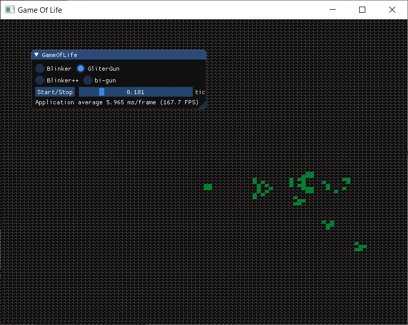
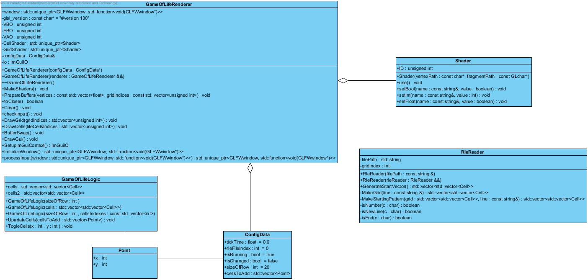

# GameOfLife
This project is based on *"Advenced C++"* course at my univeristy. Assignment was to make *["Conway's Game of Life"](https://en.wikipedia.org/wiki/Conway%27s_Game_of_Life)* cellular automata in c++ using past c++11 features both boost and stl.

## OpenGL
Choice of OpenGl as backend for visualisation is based on my plans for further development in graphic, task didn't specify what backend should be use.
For the Gui use **[ImGui](https://github.com/ocornut/imgui)**

## Buildtools
I used Cmake as it is easy to setup and crossplatform (I developed code both on Linux and Windows).
I used https://github.com/aaronmjacobs/InitGL repo for setting up Cmake.

## Building project
Prerequsition you need to have **Cmake** and some build tool e.g. **Ninja**, **GNU Make**.
1. Clone Project to your local machine
    > git clone https://github.com/Ratalx/GameOfLife.git
2. Run cmake in folder where you want to build it and as argument provide path to the folder containing CMakeList.txt e.g.:
    > .../GameOfLife/build$ cmake ..
3. Now build generated files using make, ninja or other tool
    > .../GameOfLife/build$ make
4. That will build project to GameOfLife.exe on Windows or GameOfLife on Linux
5. Then you need to move executable into the directory with *RlePatterns* and *shaders* folders as there are needed for the runtime.
6. In RlePatterns you can paste your rle file containing Conway's Game of Life pattern.

## Classes

* GameOfLifeLogic contains rules of *["Conway's Game of Life"](https://en.wikipedia.org/wiki/Conway%27s_Game_of_Life)* 

* GameOfLifeRenderer contains some abstraction over OpenGL API.

* RleReader is used to read .rle files and parsing into data.

* Shader is basic class to compile shaders used in program. I had used https://learnopengl.com/Getting-started/Shaders tutorial.

* Cell is a enum class with two states dead or alive.

* ConfigData is the data structure used as a comunication buffer between main, Logic and Rendering part of program.

## To do:
- [ ] Polish building process to remove necessity of moving executable into main directory.
- [ ] Optimize Algorithm 
